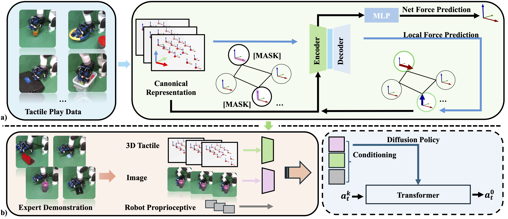

# Canonical Representation and Force-Based Pretraining of 3D Tactile for Dexterous Visuo-Tactile Policy Learning

[](https://3dtacdex.github.io/)
[](https://arxiv.org/pdf/2409.17549?)
[](https://github.com/Jiyao06/GenPose/blob/main/LICENSE)
<!-- [](https://hits.seeyoufarm.com) -->

This repo is the official implementation of ICRA 2025 paper, [3DTacDex](https://arxiv.org/pdf/2409.17549?). This repo only contain the pretrain code of tactile encoder, for the usage of encoder, please refer to [AdpaTac-Dex](https://adaptac-dex.github.io/).

<!-- ## TODOs:
- [ ] Refine -->

## Overview
 

We pretrain the 3D tactile encoder with self-supervised local force and net force prediction.

 

The pretrained encoder is used for learning dexterous, fine-grained and contact-rich tasks.

Contents of this repo are as follows:

- [Installation](#installation)
- [Example Dataset](#example-dataset)
- [Pretrain](#pretrain)
    - [Encoder Training](#encoder-training)
    - [Encoder Evaluation](#encoder-evaluation)
- [Notes](#notes)
- [Acknowledgement](#acknowledgement)
- [Citation](#citation)
- [Contact](#contact)
- [License](#license)


## Installation

### Requirements
The code has been tested on Ubuntu 20.04 with Python 3.9. 

### Install
Please install with "3dtacdex.yaml". There might be severl conflict of different package, especially for "networkx, numpy, tensorboardX". 

Or install with following python packages :
``` 
ipdb
tqdm
scipy
urdfpy
opencv-python
roma
networkx==2.5
numpy==1.23.3
torch
torchvision
torch_geometric
tensorboardX==2.5.1
```

## Example Dataset
You can download example tactile play data from [Google Drive](https://drive.google.com/file/d/1L-cWBaK0il9YnlPADdfovq2Msn-K87QM/view?usp=drive_link). This example dataset is used for running the code. As for custom usage, I highly recommand you collect your own play data follow [T-DEX](https://tactile-dexterity.github.io/), since you may use different dexterous hands, tactile sensors, and distributions.
## Pretrain 

### Encoder Training
```
sh ./pretrain_train.sh
```

### Encoder Evaluation
We choose the checkpoint that has both low local masked force reconstruction error and net force prediction error. Pretrain model checkpoint is "ckpts/all.pt", which is used for evaluation.
```
sh ./pretrain_eval.sh
```
Pretrain encoder checkpoint is "ckpts/encoder.pt", which is used for downstream tasks.

## Notes 
1. Mask index is used for indexing force during masking, which is 9 in our representation.
2. Mask rate is the ratio of mask number / total force number, which is highly depend on the resolution of each sensor.
3. Current tactile pose and force is with respect to hand base frame.
4. TACTILE_RAW_DATA_SCALE is set to 50, which is the scale of the tactile data.
5. Be careful to check the frame of point and force, make sure they are in same frame.
6. If the local force prediction error and net force prediction error are not the lowest at same ckpt, we would recommand use the ckpt that has lower net force prediction error.

## Acknowledgement
The code used in this project is built from these repository:

[THUDM/GraphMAE](https://github.com/THUDM/GraphMAE)

[real-stanford/diffusion_policy](https://github.com/real-stanford/diffusion_policy)

[SridharPandian/Holo-Dex](https://github.com/SridharPandian/Holo-Dex)


## Citation
If you find our work useful in your research, please cite.
<!-- ``` bash
@article{wu2023learning,
  title={Learning Score-based Grasping Primitive for Human-assisting Dexterous Grasping},
  author={Tianhao Wu and Mingdong Wu and Jiyao Zhang and Yunchong Gan and Hao Dong},
  booktitle={Thirty-seventh Conference on Neural Information Processing Systems},
  year={2023},
  url={https://openreview.net/forum?id=fwvfxDbUFw}
}
``` -->

## Contact
If you have any suggestion or questions, please feel free to contact us:

[Tianhao Wu](https://tianhaowuhz.github.io/): [thwu@stu.pku.edu.cn](mailto:thwu@stu.pku.edu.cn)

## License
This project is released under the MIT license. See [LICENSE](LICENSE) for additional details.


